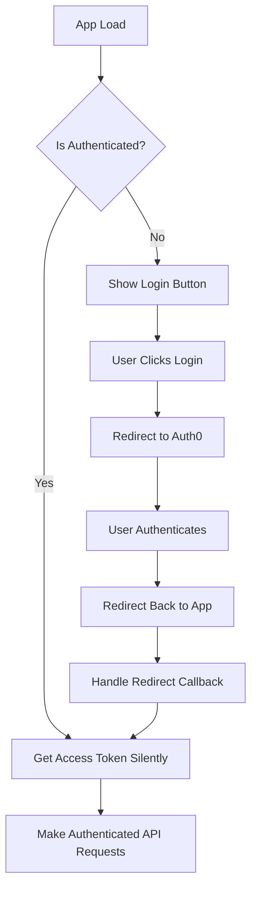

# trad-web-client

This project is a Vue 3 + Vite client for the trading platform. It now includes an initial Trading Terminal layout inspired by the reference screenshot.

## Trading Terminal UI

Navigate to `http://localhost:5173/terminal` (root `/` redirects there) to view the terminal.

Current panels (live mock data via Pinia store):

- Log (`TerminalLogPanel`)
- Price Chart (`TerminalChartPanel`)
- Order/Device Execution Tree (`TerminalOrderTree`)
- Trailing / Entry Devices Table (`TerminalEntriesPanel`)
- Device Details (`TerminalDeviceDetails`)
- Command Input (`TerminalCommandInput`)

Layout uses `dockview-vue` docking manager in `views/TradingTerminal.vue` (the earlier CSS Grid prototype was replaced). Theme variables live in `src/assets/main.css`.

### Current Features Summary

- Docking layout with persistence & reset
- Live mock streaming ticks & logs (Pinia)
- Device selection sync across tree/table/details
- Lightweight charts area series updating in real-time
- Command input with simple commands (`select`, `log`)
- Multi-theme support (dark + light) with OS preference detection & persistence

## Docking Layout (Dockview) & Persistence

The terminal composes panels through `dockview-vue`. On first load a default arrangement is created; thereafter the layout is serialized every few seconds (and on unload) to `localStorage` under the key `terminalLayoutV1` and restored automatically.

Panels added (ids): `log`, `tree`, `chart`, `details`, `entries`, `cmd`.

Reset the layout with the `Reset Layout` button in the top-right toolbar (this clears persisted state and rebuilds the default arrangement).

### Themes (Dark / Light)

A light theme has been added via CSS variable overrides scoped by the `theme-light` class on `<html>`. The active theme is stored in `localStorage` (`ui.theme.v1`) and defaults to the user's OS preference on first load.

Toolbar button toggles between themes (`Light Theme` / `Dark Theme`).

You can also toggle manually in dev tools:

```js
localStorage.setItem('ui.theme.v1', 'light'); location.reload();
// or
localStorage.setItem('ui.theme.v1', 'dark'); location.reload();
```

### Data & State (Pinia)

`src/stores/terminal.ts` hosts a Pinia store that simulates:

- Streaming price ticks (random walk) feeding the chart (`priceSeries` + `lastPrice`).
- Log lines (capped at 500) generated from ticks and user commands.
- Entry devices list with selection synchronization across panels (Entries table, Details panel, Tree panel).

### Chart

Implemented with `lightweight-charts@5` using an Area series. Data updates incrementally (`series.update`) for efficient rendering.

### Command Input

Basic commands (extendable):

- `select <deviceId>` – selects a device.
- `log <message>` – appends a custom log line.

### Future Ideas

- WebSocket integration for real market & device events.
- Device CRUD via commands (`add`, `remove`).
- Execution markers and trade overlays on chart.
- Persist command history & keyboard navigation.
- High-contrast / additional colorblind-friendly themes.

## Recommended IDE Setup

[VSCode](https://code.visualstudio.com/) + [Volar](https://marketplace.visualstudio.com/items?itemName=Vue.volar) (and disable Vetur).

## Type Support for `.vue` Imports in TS

TypeScript cannot handle type information for `.vue` imports by default, so we replace the `tsc` CLI with `vue-tsc` for type checking. In editors, we need [Volar](https://marketplace.visualstudio.com/items?itemName=Vue.volar) to make the TypeScript language service aware of `.vue` types.

## Customize configuration

See [Vite Configuration Reference](https://vite.dev/config/).

## Project Setup

```sh
bun install
```

### Compile and Hot-Reload for Development

```sh
bun dev
```

### API proxy and Auth0 tokens

During development, API requests to `/api/*` are proxied to `VITE_API_TARGET` (default `http://localhost:5173`). The dev proxy is configured in `vite.config.ts` and strips the leading `/api` when forwarding. Adjust the `rewrite` rule as needed for your backend.

This app uses Auth0. When making requests via the helpers in `src/lib/apiClient.ts`, an `Authorization: Bearer <token>` header is attached automatically when the user is authenticated. Make sure to set the correct `VITE_AUTH0_AUDIENCE` (and optional `VITE_AUTH0_SCOPE`) so that the token contains your API audience.

Env variables:

- `VITE_AUTH0_DOMAIN`
- `VITE_AUTH0_CLIENT_ID`
- `VITE_AUTH0_AUDIENCE` (optional but recommended for API access)
- `VITE_AUTH0_SCOPE` (optional; default `openid profile email`)
- `VITE_API_BASE` (prod base URL for API; defaults to `/api`)
- `VITE_API_TARGET` (dev proxy target; defaults to `http://localhost:5173`)

Example usage:

```ts
import { apiGet, apiPost } from '@/lib/apiClient'

// GET /api/health (in dev) or `${VITE_API_BASE}/health` in prod
const health = await apiGet<{ ok: boolean }>('/health')

// POST to /api/orders
const order = await apiPost('/orders', { symbol: 'BTCUSD', side: 'buy' })
```

### Authtentcation flow

This app uses [Auth0 SPA SDK](https://auth0.com/docs/libraries/auth0-spa-js) for authentication. The main logic is in `src/lib/auth.ts` and the Auth0 provider is configured in `src/main.ts`.



### Type-Check, Compile and Minify for Production

```sh
bun run build
```

### Lint with ESLint

```sh
bun lint
```
